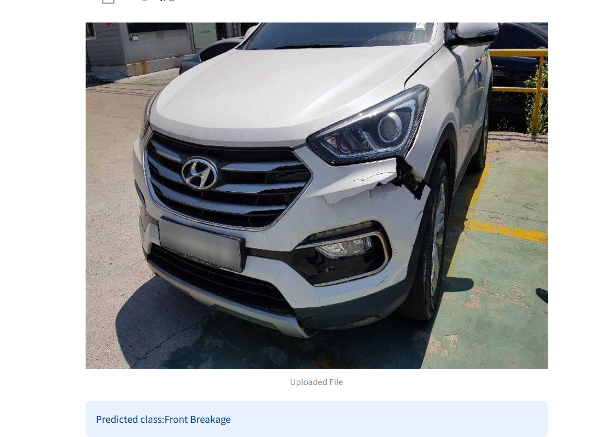
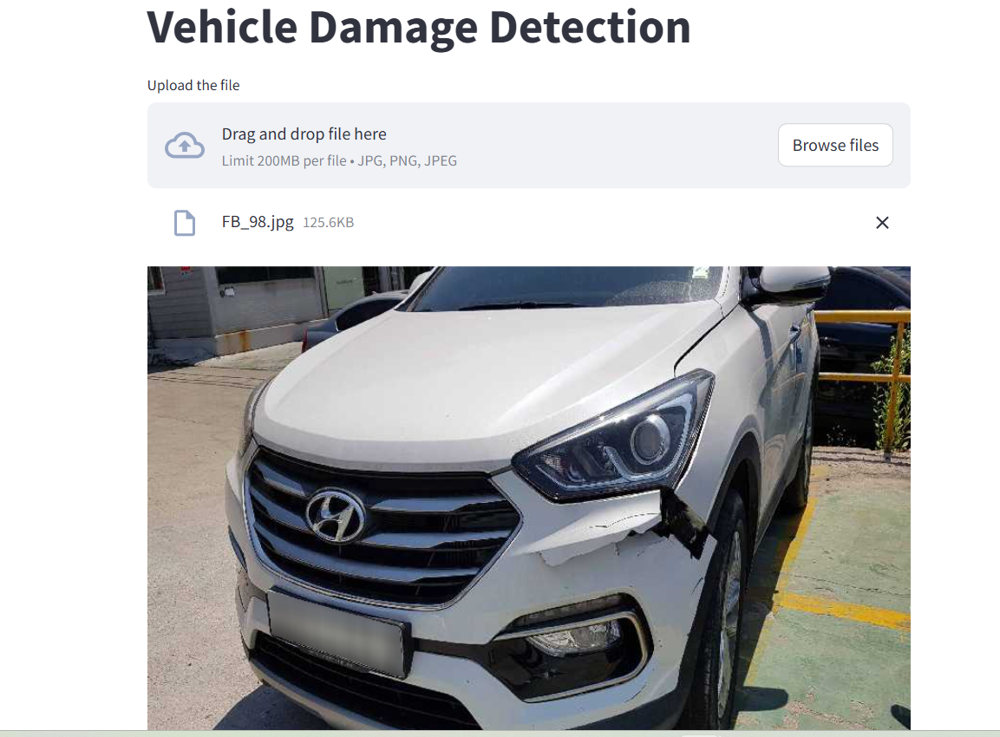

# Vehicle Damange Detection App

The objective of this project is to develop a Proof of Concept (POC) for car damage detection 
that can classify the condition of a car's front and rear into six predefined categories. The 
solution is delivered as a trained machine learning model integrated into a Streamlit 
app.





### Model Details
1. Used ResNet50 for transfer learning
2. Model was trained on around 1700 images with 6 target classes
   1. Front Normal
   1. Front Crushed
   1. Front Breakage
   1. Rear Normal
   1. Rear Crushed
   1. Rear Breakage
9. The accuracy on the validation set was around 80%

### Set Up

1. To get started, first install the dependencies using:
    ```commandline
     pip install -r requirements.txt
    ```
   
2. Run the streamlit app:
   ```commandline
   streamlit run app.py